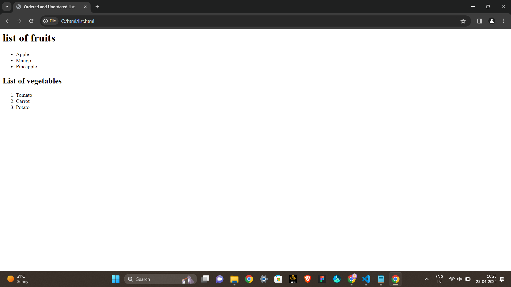

# Ex.02 Implementation of Lists
## AIM
  To create list of Departments in an Institution.

## ALGORITHM
### STEP-1
  Open notepad and type the HTML code.

### STEP-2
  Create an ordered list using ```<ol>``` tag.

### STEP-3
  List the Departments using ```<li>``` tag.

### STEP-4
  Create an unordered list using ```<ul>``` tag for nesting lists.

### STEP-5
  Open the file in a browser and verify the output.
  
## CODE
```
<html>
<head>
<title>
Ordered and Unordered List
</title>
</head>
<body>
<h1> list of fruits </h1>
<ul>
<li> Apple </li>
<li> Mango </li>
<li> Pineapple </li>
</ul>
<h2> List of vegetables </h2>
<ol>
<li> Tomato </li>
<li> Carrot </li>
<li> Potato </li>
</ol>

</body>
</html>
```

## OUTPUT


## RESULT
  List of Departments in an Institution is created successfully.
